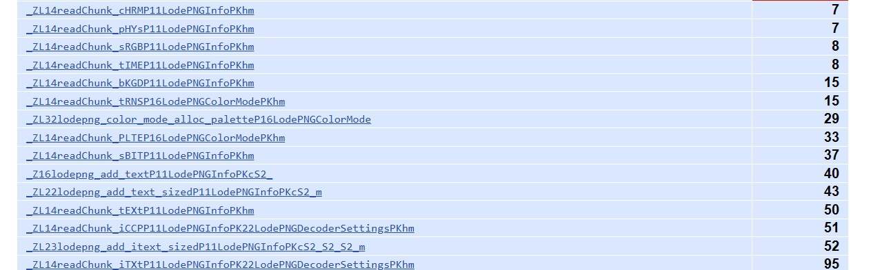
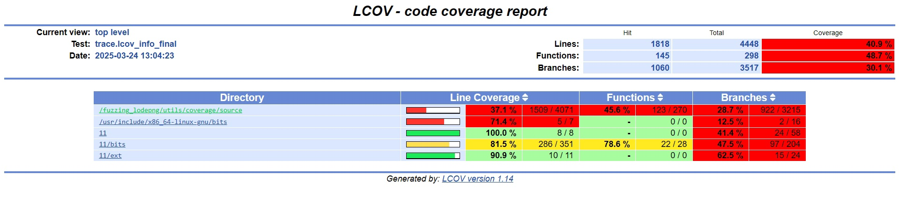
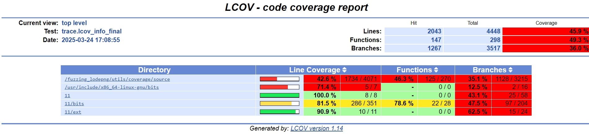
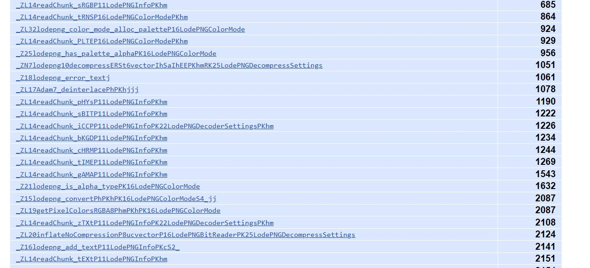

# fuzzing_lodepng
Fuzzing of lodepng library

Это проект по фаззингу!
Выполнение немного задержалось возникли небольшие (большие) проблемы с поиском бага в программе мутатора, поиск вызывал большие сложности, так как приходилось использовать мало знакомые библиотеки)

Я выполняю задание по фаззингу. 

-------------------------------------------------------------------------------------------------------------------------------

О ОБЪЕКТЕ ФАЗЗИНГА

Проект был выбран следующий: https://github.com/lvandeve/lodepng
Это по сути своей библиотека для работы с png файлами. (Изначально была выбрана библиотека libpng для ее фаззинга, но уже после реализации фаззинга я с ужасом понял, что ее нет в списке проектов github в том файле. С этим тоже связана задержка выполнения задания)
Сам объект для фаззинга был взят как пример из данной библиотеки, демонстрирующий ее работу.
Я выбирал из всех примеров тот, что больше всего связан непосредственно с чтением файлов, так как функции чтения и парсинга наиболее приоритетные цели при фаззинге.

-------------------------------------------------------------------------------------------------------------------------------

УСТАНОВКА

Для установки будут нужны установленная библиотека libpng и сам фаззер AFL++

Для того чтобы скомпилировать проект досточно будет сделать 2 make в корневой папке проекта, на возможные Warnings не стоит обращать внимания)
AFL_HEADERS должна быть устанослена и указывать на директорию с header файлами AFL++, путь должен быть ПРЯМЫМ, а НЕ ОТНОСИТЕЛЬНЫМ

```bash
AFL_HEADERS=/path/to/AFLplusplus/include make customs_libs
make all

```

(надеюсь работает корректно)
-------------------------------------------------------------------------------------------------------------------------------

О МОЕМ МУТАТОРЕ 

Был реализован кастомный мутатор на языке Си с использованием библиотеки libpng.
Бибилиотека была выбрана достаточно низкоуровневая для получения большего простора для манипуляций с png файлами.

{ 
  немного о png формате: 
  картинка png состоит из различных сегментов - чанков, хранящих в себе какую-то информацию. Она может быть сжата, а может быть и нет. 
  В начале каждого чанка есть его индетификатор, и информация о его структуре и размерах. В конце каждого чанка есть контрольная сумма. 
}
  
В ходе пробных запусков фаззера (без мутатора) и анализа функций были найдены "узкие места". Это как правило не основные чанки, хранящие данные необязательные для корректного открытия и чтения png.
В этом можно убедится взглянув на результаты почти 3ех часового фаззинга (файл 2h_without_custom_mutator) на в данных о покрытии кода. 

Поадания в необязательные чанки: cHRM, tIME, pHYs, sRGB, bKGD, tRNS, PLTE, sBIT, tEXt, iTXt, iCCP и т.д.




Поэтому было решено реализовать мутатор случайным образом выбирающий допустимые и поддерживаемые libpng чанки и корректно записывающий их в буффер.

[Полный список реализованых чанков](include/png_processing.h)


Основная библиотека, реализующая добаление чанков случайным образом находится в [png_random.c](src/lib_png_random/png_random.c)

Реализация чуть более детально будет расписана здесь.


-------------------------------------------------------------------------------------------------------------------------------

О РЕЗУЛЬТАТАХ ФАЗЗИНГА

К сожалению, чтобы подробнее посмотреть отчеты их придется загрузить открыть при помощи браузера (они в html формате и другого способа я не нашел)


Подробные отчеты о фаззинге БЕЗ МУТАТОРА можно найти в файлах [Статистика по линиям фаззинга без мутатора](docs/2_hours_without_custom_mutator_report/index.html), 
[Статистика по функциям фаззинга без мутатора](docs/2_hours_without_custom_mutator_report/fuzzing_lodepng/utils/coverage/source/main.cpp.func-sort-c.html)

Статистика по линиям:



Подробные отчеты о фаззинге С МУТАТОРОМ можно найти в файлах [Статистика по линиям фаззинга с мутатором](docs/1_hour_custom_fuzzing_report/web/index.html), 
[Статистика по функциям фаззинга с мутатором](docs/1_hour_custom_fuzzing_report/web/fuzzing_lodepng/utils/coverage/source/lodepng.cpp.func-sort-c.html)

Статистака по линиям:



Сразу же заметен прирост колличества линий и функций. Однако это только первый взгляд на результаты. При детальном рассмотрении все становится еще лучше!

Рассмотрим теперь те же функции чтения чанков:




Виден огромный припрост в колличестве их вызов, а следственно можно утверждать, что фаззер лучше справляется с тестированием программы. Больше попаданий == программа лучше протестирована. 

Аналогичные результаты можно наблюдать в функциях, отвечающих за чтение и анализ основных чанков. Результаты показывают, что попадание даже в основные чанки возросло неменее чем в 2 раза (это функции чтения info и idat). 


-------------------------------------------------------------------------------------------------------------------------------

ВЫВОДЫ

Можно говорить, что мутатор хорошо справляется со своей задачей. Наверника его можно еще немного улучшить добавив случайный порядок записи чанков (достаточно сложно, необходимо углубиться в документацию о чанках и переписать большое колличество кода) или например добавить больше поддерживаемых языков в чанке iTXt (это задача чисто механическая и нетрудно выполнимая).
