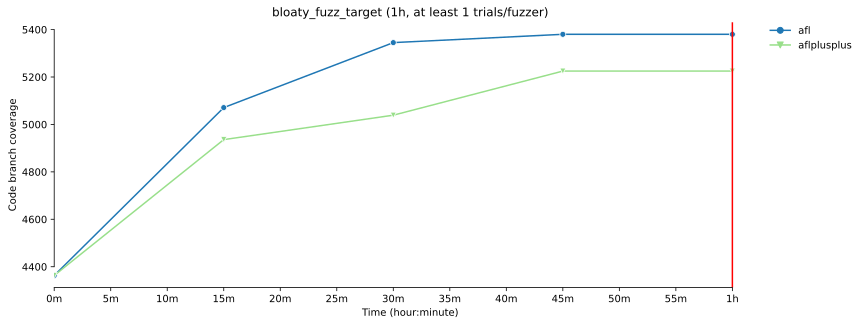
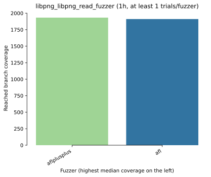
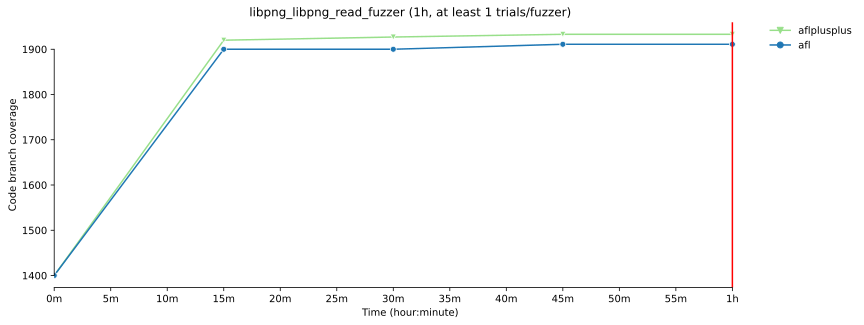
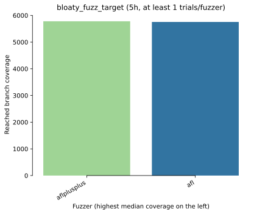
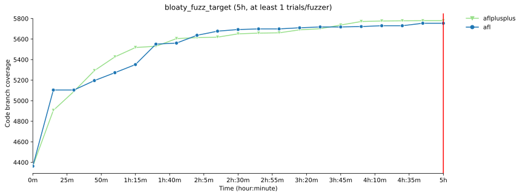
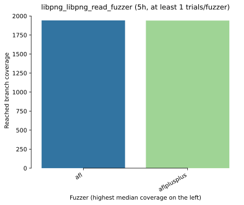
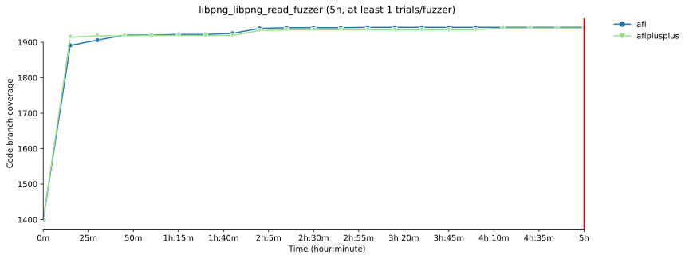

# fuzzbench
 
Я установил и запустил эксперимент над фаззерами при помощи fuzzbench.  
Я для этого выбрал 2 фаззера: afl и afl++  
Бенчмарки: libpng_libpng_read_fuzzer и bloaty_fuzz_target  
Количество испытаний: 1  
Время одного испытания: 1 час  

Все файлы отчета можно увидеть в директории [afl_x_aflplusplus](docs/fuzzbench/afl-x-aflplusplus)
  

!!! Добавлены новые результаты 5 часового эксперимента в директории [5h_afl_aflplusplus](docs/fuzzbench/5h_afl_x_aflplusplus)!!!   
Я для этого выбрал 2 фаззера: afl и afl++  
Бенчмарки: libpng_libpng_read_fuzzer и bloaty_fuzz_target  
Количество испытаний: 1  
Время одного испытания: 5 час  
  

### Демонстрация работы фаззеров 

  

## РЕЗЮМЕ ИСПЫТАНИЯ НА БЕНЧМАРКЕ BLOATY_FUZZ_TARGET (1 час)
 

### Рейтинг по медианному охвату  

 

### Средний рост покрытия с течением времени  

 

## РЕЗЮМЕ ИСПЫТАНИЯ НА БЕНЧМАРКЕ LIBPNG_LIBPNG_READ_FUZZER (1 час)
 

### Рейтинг по медианному охвату  

 

### Средний рост покрытия с течением времени  

 

## РЕЗЮМЕ ИСПЫТАНИЯ НА БЕНЧМАРКЕ BLOATY_FUZZ_TARGET (5 часов)
 

### Рейтинг по медианному охвату  

 

### Средний рост покрытия с течением времени  

 

## РЕЗЮМЕ ИСПЫТАНИЯ НА БЕНЧМАРКЕ LIBPNG_LIBPNG_READ_FUZZER (5 часов)
 

### Рейтинг по медианному охвату  

 

### Средний рост покрытия с течением времени  

 

## ВЫВОД
 
Такое количество испытаний и времени потраченного на тестирование фаззера не является объективным показателем эффективности фаззеров,
на основе полученных результатов сложно сделать вывод об эффективности afl++ по сравнению с afl. По результам 1 часового эксперимента на bloaty_fuzz_target afl++ показал себя хуже чем afl однако, как показывают отчеты и результаты 5 часового эксперимента, на большем промежутке afl++ выиграет. На libpng_libpng_read_fuzzer 
в точности наоборот. 
 

Изходя из результатов 5 часового эксперимента, можно сказать, что afl++ выигрывает afl (по крайней мере в 1ом испытании).
